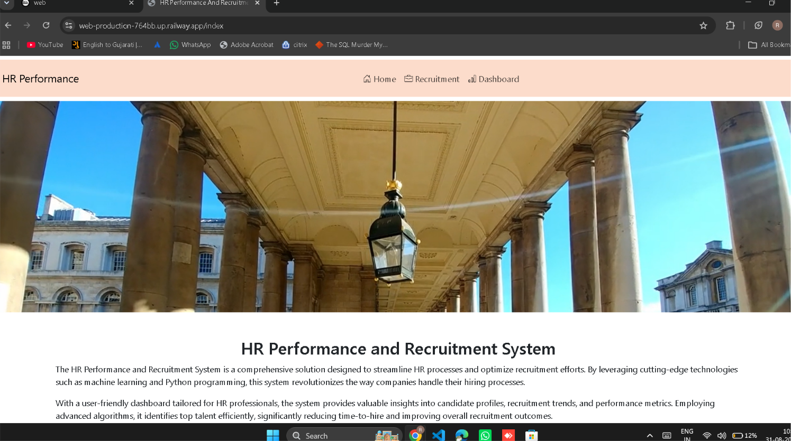
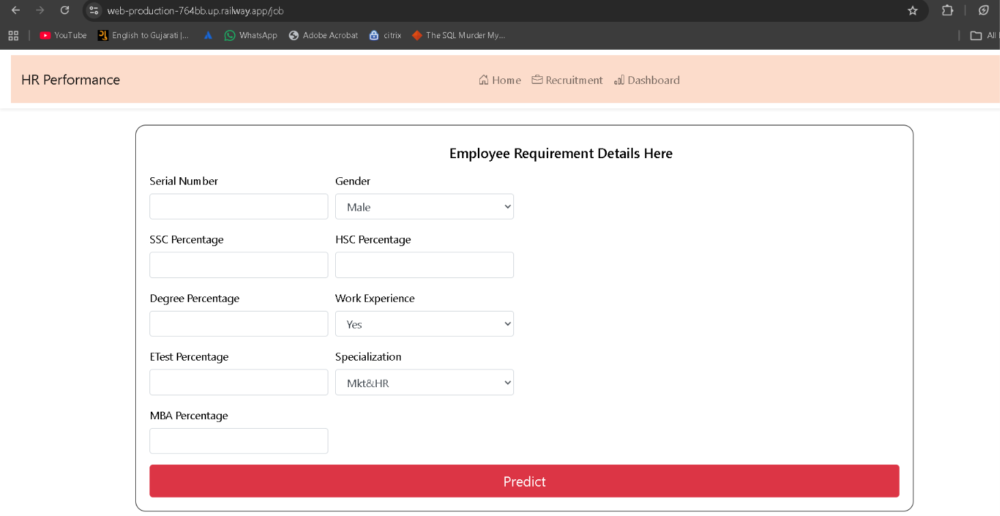
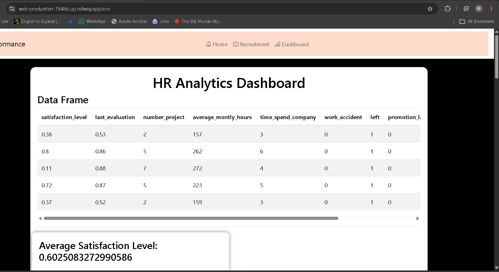

# HR Performance and Recruitment System

A full-stack machine learning web application that streamlines HR processes — combining employee attrition analytics with an ML-powered recruitment prediction tool, all wrapped in a clean, easy-to-use dashboard.

**🔗 Live Demo:** [web-production-ef62e.up.railway.app](https://web-production-ef62e.up.railway.app)

---

## 📌 Overview

The HR Performance and Recruitment System is designed to help HR professionals make faster, data-backed decisions. It combines two core capabilities:

- **Recruitment Prediction** — predicts whether a candidate is likely to be placed based on their academic and test performance, using a trained ML model.
- **HR Analytics Dashboard** — visualizes employee data (satisfaction level, workload, tenure, attrition) to surface trends that help reduce employee turnover.

Built with **Python, Flask, scikit-learn, and Matplotlib/Seaborn**, and deployed on **Railway**.

---

## ✨ Features

- 🏠 **Home Page** — clean landing page introducing the system
- 💼 **Recruitment Module** — form-based candidate evaluation using a trained classification model (`model.pkl` + `scaler.pkl`)
- 📊 **HR Analytics Dashboard** — auto-generated visualizations:
  - Correlation with attrition (`left`)
  - Satisfaction level distribution
  - Department-wise and salary-wise attrition breakdown
  - Number of projects vs. attrition
  - Average satisfaction level summary
- ⚙️ Server-side chart generation (Matplotlib `Agg` backend) — fast, thread-safe, no GUI dependency

---

## 🖼️ Screenshots

**Home Page**


**Recruitment Prediction Form**


**HR Analytics Dashboard**


---

## 🛠️ Tech Stack

| Layer          | Technology                          |
|----------------|--------------------------------------|
| Backend        | Python, Flask                        |
| ML / Data      | scikit-learn, pandas, numpy          |
| Visualization  | Matplotlib, Seaborn                  |
| Frontend       | HTML, CSS (Jinja2 templates)         |
| Deployment     | Railway (Gunicorn WSGI server)       |
| Version Control| Git & GitHub                         |

---

## 📂 Project Structure

```
ML Project 1/
├── app.py                     # Main Flask application
├── Procfile                   # Deployment entrypoint (gunicorn)
├── requirements.txt           # Python dependencies
├── models/
│   ├── model.pkl              # Trained classification model
│   └── scaler.pkl             # Feature scaler
├── notebook/
│   ├── HR_comma_sep.csv       # HR attrition dataset
│   ├── Placement_Data_Full_Class.csv
│   ├── HR analysis.ipynb
│   └── Recruitement system Model.ipynb
├── templates/
│   ├── index.html             # Home page
│   ├── job.html                # Recruitment prediction form
│   └── ana.html                # Analytics dashboard
└── static/                    # Generated charts & assets
```

---

## 🚀 Getting Started (Local Setup)

1. **Clone the repository**
   ```bash
   git clone https://github.com/riteshpanchal0906/recruitment-system-prediction.git
   cd recruitment-system-prediction
   ```

2. **Install dependencies**
   ```bash
   pip install -r requirements.txt
   ```

3. **Run the app**
   ```bash
   python app.py
   ```

4. Open `http://127.0.0.1:5000` in your browser.

---

## ☁️ Deployment

This project is deployed on **Railway** using Gunicorn as the WSGI server:

```
web: gunicorn app:app --bind 0.0.0.0:$PORT
```

Matplotlib is configured with the non-GUI `Agg` backend (`matplotlib.use('Agg')`) to ensure thread-safe chart generation in a production server environment.

---

## 📈 How the Prediction Works

The recruitment module takes in:
- Gender, Work Experience, Specialization
- SSC / HSC / Degree / E-Test / MBA percentages

...and passes them through a pre-trained scikit-learn pipeline (`scaler.pkl` → `model.pkl`) to predict placement likelihood.

The analytics dashboard reads the HR dataset directly and generates fresh visualizations on each request, giving an always-current view of workforce trends.

---

## 🧑‍💻 Author

**Panchal Ritesh**
B.Tech Computer Science — Gandhinagar Institute of Technology

---

## 📄 License

This project is open for educational and portfolio purposes.
